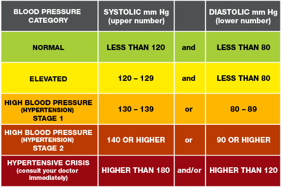

- Discuss Final
- What would you like me to review/discuss?
- Stroke

# Setup

- Import our patient data and take a look.
- What do you think are the top risk factors for stroke?
- Can you immediately think of any other features (columns) you wish you had?
- Do you think a logistic regression or random forest can produce the best model?

```{r}
library(rpart)
library(rpart.plot)
library(knitr)
library(modelr)
library(tidyverse)
## Most CSV files will have a blank where the value is null. This dataset uses
## N/A to denote missing data, which is fine, but we need to remove this and
## replace it with R's NA value. Otherwise, the bmi column will be a character
## column when it should be a number.
patients <- read_csv("data/healthcare-dataset-stroke-data.csv", na = "N/A")
names(patients) <- tolower(names(patients))
patients
```

- Appreciate how much work went into developing this data set.
- But, be aware of the choices that were made for you.
- Residence Type is either rural or urban. Apparently suburbia doesn't exist?
- Hypertension is a TRUE/FALSE.
    - A diagnosis of hypertension is based on blood pressure, a continuous variable.
    - https://www.heart.org/en/health-topics/high-blood-pressure
    - https://www.ahajournals.org/doi/10.1161/hypertensionaha.111.177766



- These are the current accepted standards.
- But we are not trying to diagnose someone with hypertension!
- We are trying to predict stroke!
    - Is it possible risk of stroke increases in the pre-hypertensive range?
    - And it totally makes sense that if someone is anywhere near 180, there risk IS higher.
    - But we can't use that. All we can do is say yes/no.
    - This is called discretization. It is bad. Do not do this.
    - If you have a continuous variable, use it as such.
    - Because if you don't, I will hunt you down.
    - And you are throwing away information.
- Hypertension is especially interesting because you actually have MANY measurements.
    - And there's value/information there too.
    - A single value (the most recent) is probably the most valuable.
    - But what about rate of change?
    - On average, HBP rises as we age. The rate of that change is unique to each of us.
        - And that rate of change itself could have valuable information.
        - STOP THROWING AWAY DATA!
    - Well, we will never know!

## Missing Data

- We've glossed over this in prior weeks, but missing data is bad because it can't tell us anything.
- Tonight, we will actually "handle" the missing data.

```{r}
patients %>%
  summarize(
    gender = sum(is.na(gender)),
    age = sum(is.na(age)),
    hypertension = sum(is.na(hypertension)),
    heart_disease = sum(is.na(heart_disease)),
    ever_married = sum(is.na(ever_married)),
    work_type = sum(is.na(work_type)),
    residence_type = sum(is.na(residence_type)),
    avg_glucose_level = sum(is.na(avg_glucose_level)),
    bmi = sum(is.na(bmi)),
    smoking_status = sum(is.na(smoking_status)),
    stroke = sum(is.na(stroke)),
  )
```

- The only feature with missing data is `bmi`, and even then, only 201 rows.
- In fairness, we could justify throwing those 201 rows out, unless we look at it more carefully and determine there's something that biases who has missing data.
- Or we could just do something about it.
- The goal is to not skew our prediction of stroke and use all of our data (collecting data is expensive)
- So, what do we want to do?

```{r}
patients %>%
  filter(!is.na(bmi)) %>%
  group_by(gender) %>%
  summarize(avg_bmi = mean(bmi), n = n())
```
Some context. If your BMI is:

- below 18.5 – you're in the underweight range
- between 18.5 and 24.9 – you're in the healthy weight range
- between 25 and 29.9 – you're in the overweight range
- between 30 and 39.9 – you're in the obese range

The calculation above tells us the average BMI of our patients, by gender, is overweight. The only exception is where gender is other, which is in the normal range. That particular person is not however helpful because there is only one such patient.

```{r}
patients %>%
  filter(is.na(bmi)) %>%
  group_by(gender) %>%
  summarize(n = n())
```

Welcome to imputation. Keep the data, try to not bias your results. In our case, we are going to simply replace the BMI for the 97 females with 29.1 and for the 104 males, 28.6. If we had more missing data, I would take the time to do something more detailed, for example, including age, but that time has passed.

```{r}
patients <-
  patients %>%
  mutate(
    bmi = case_when(
      gender == "Female" & is.na(bmi)~29.1,
      gender == "MAle" & is.na(bmi)~28.6,
      TRUE~bmi)
    )
```

- Justification, we are setting these 201 cases to the AVERAGE score, which should not bias these cases.
- Yet, if they have other useful risk factors, we can use that information.

## Partitioning

- Train v Test
- Cage Match!!!!!

No more overfitting PLEASE!!

```{r}
## We will use an 80/20 split
## I removed id, because there's no information there and I don't want anyone
## to use that as a feature in a model.
data <- resample_partition(patients %>% select(-id), c(test = 0.2, train = 0.8))
## This converts out data into a more complex list, but it is easy to use in
## modeling functions. For everything else, use the original data.
## Also, remember that you need to complete all data management tasks BEFORE you 
## perform this split.
data$test
```

- We will train our model on the training set and then validate those results against test.
- Yes, we are giving up some degree of statistical power in doing so.
- Please, do, cry me a river.
- If the results are quite different, then we have overfit our model.
- We will not go so far as to perform a statistical test on this difference, but we will assess for overfitting.

# Risk Of Stroke

Within this population, what is the risk of stroke?

```{r}
patients %>%
  summarize(
    stroke = sum(stroke),
    no_stroke = n() - stroke
  ) %>%
  mutate(
    r_stroke = round(stroke/(stroke+no_stroke),4),
    o_stroke = round(stroke/no_stroke,4)
  )
```

- The risk of having a stroke (r_stroke) is similar to the odds of having a stroke (o_stroke).
- This was not the case with our titanic example.

What about the odds ratio for gender? Do men or women have a higher odds of having a stroke?

```{r}
patients %>%
  group_by(gender) %>%
  summarize(
    stroke = sum(stroke),
    no_stroke = n() - stroke
  ) %>%
  mutate(
    r_stroke = round(stroke/(stroke+no_stroke),4),
    o_stroke = round(stroke/no_stroke,4)
  )
```

Men clearly have the higher odds.

```{r}
risk_ratio <- 0.0511/0.0471	
odds_ratio <- 0.0538/0.0494	
message("Risk Ratio: ", round(risk_ratio,4))
message("Odds Ratio: ", round(odds_ratio,4))
```

- And because this is a relatively rare event, the odds ratio will be quite similar to the risk ratio.
- And, to be sure, this is a real risk. Men are more likely to have strokes.

What about hypertension? Can you calculate the risk/odds ratio for hypertension?

```{r}
## YOUR CODE HERE!

```


# Cart Model - Fail

- So, if we build a CART model (decision tree) with all of our factors, what do we get?

```{r}
cart_model <- rpart(stroke~., data = data$train, method = "class")
summary(cart_model)
rpart.plot(cart_model)
```

- CART models generally perform poorly where the incidence rate is below 15%.
    - There's just no way for them to meaningfully put all or most of the strokes into one bucket.
- You can use boosting to work around this for predictive models, but this does not work as well for inferential modeling.
- Fortunately, logistic regression still works well in this context.

# Logsitic Regression

- Prove we can connect logistic regression to the odds ratio.
- Calculate the odds ratio of stroke for the hypertension feature.

```{r}
log_model <- glm(stroke~hypertension, data = data$train, family = "binomial")
summary(log_model)
message("Odds Ratio Hypertension: ", round(exp(log_model$coefficients)[2],4))
```

Let's talk about how to tell if one model is better than another.

- Accuracy, which we've discussed before.
- AIC, Akaike information criterion (Akaike, 1974)
    - AIC is a fined technique based on in-sample fit to estimate the likelihood of a model to predict/estimate the future values. 
    - A good model is the one that has minimum AIC among all the other models. ... A lower AIC or BIC value indicates a better fit.
    
```{r}
## Confusion Matrix
confused_data <- 
  data$train$data %>%
  add_predictions(log_model) %>%
  tibble() %>%
  mutate(
    pred_exp = exp(pred),
    pred_stroke = if_else(pred_exp >= 1, 1,0),
    pred_not_stroke = if_else(pred_exp < 1, 1,0),
  )
confusion_matrix <- 
  confused_data %>%
  group_by(stroke) %>%
  summarise(pred_stroke = sum(pred_stroke, na.rm = TRUE),
            pred_no_stroke = n() - sum(pred_stroke, na.rm = TRUE)
            )
confusion_matrix

## Accuracy
accuracy <-
  confusion_matrix %>% 
  summarize(
    ## This is just the total of right answers divided by the total number of rows.
    (pred_stroke[stroke == 1] + pred_no_stroke[stroke == 0]) / nrow(confused_data)
  )
accuracy * 100
```

- And . . . . of course this is what it does.
- It is 95% right because it predicted nobody had a stroke.
- And that is because predicting WHICH PATIENT is going to have a stroke is HARD.
- Which is why we spend so much time talking about ODDS/RISK and not WHICH.
- And, frankly, that is still useful.
